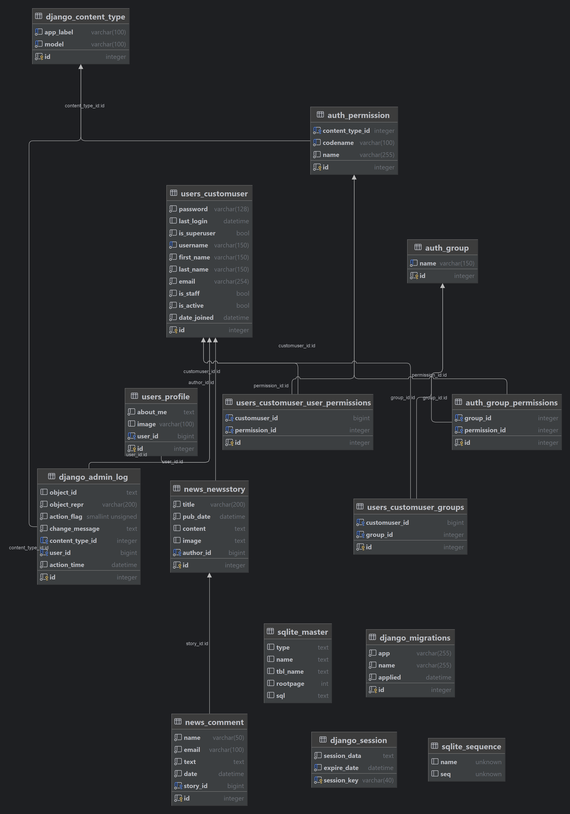
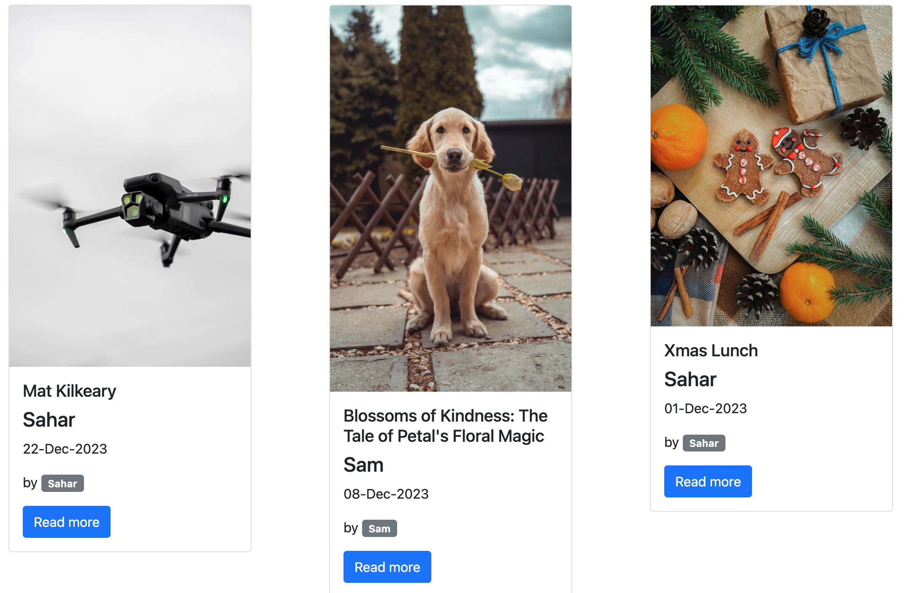
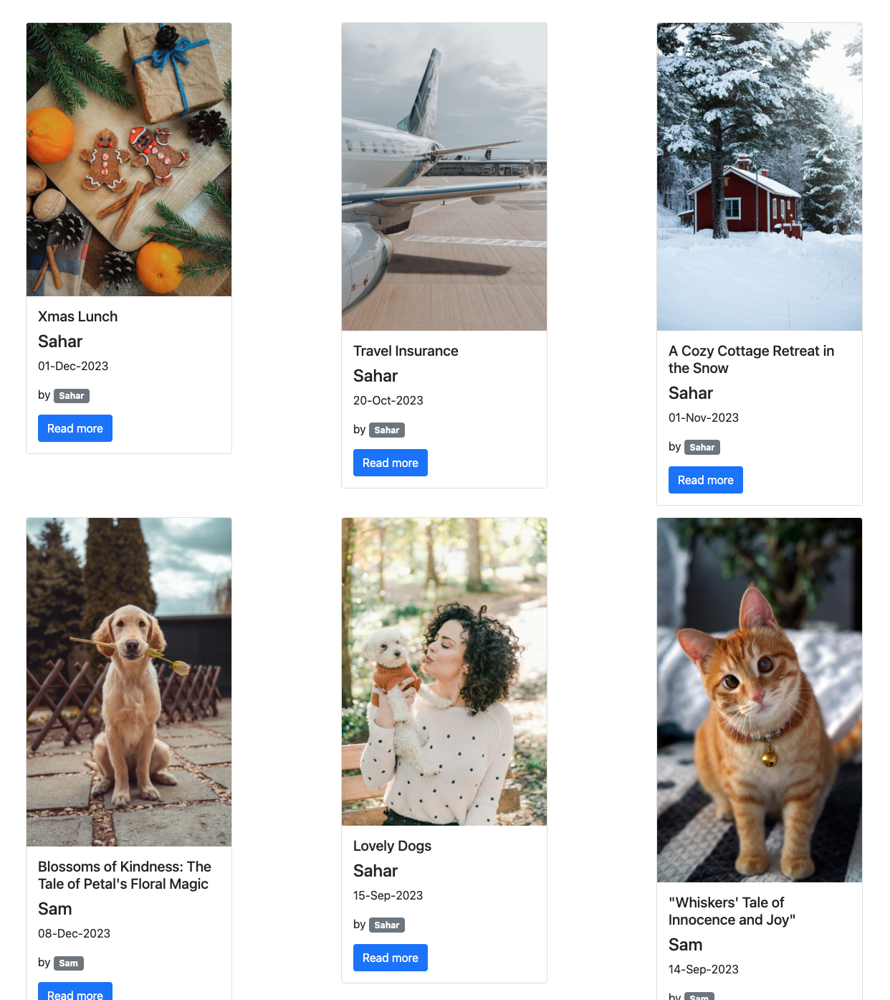
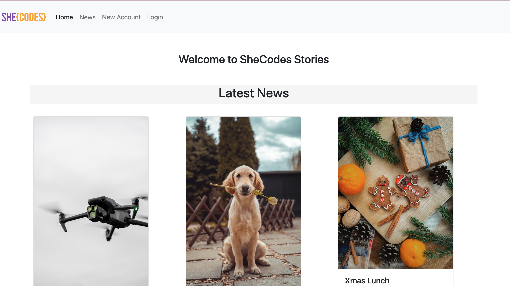
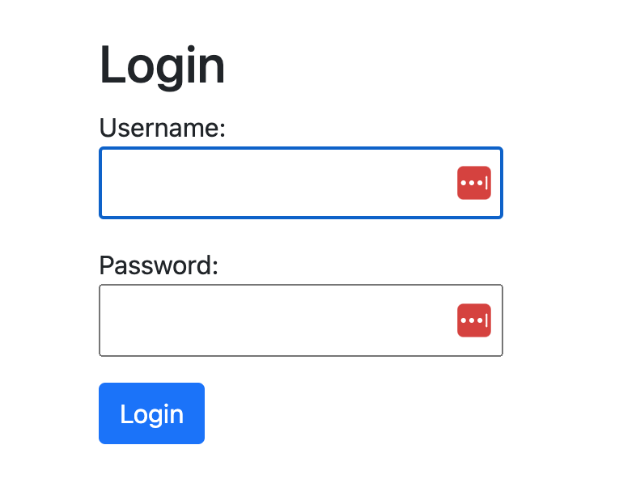
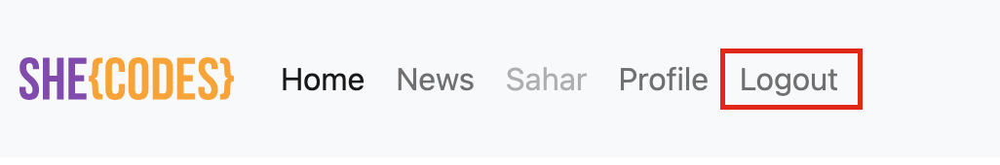
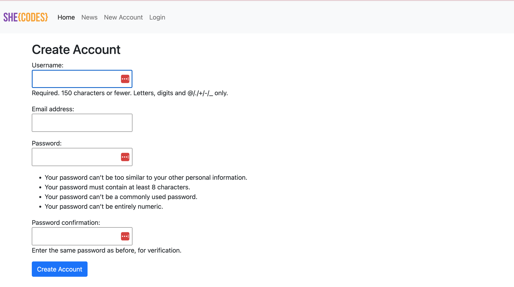
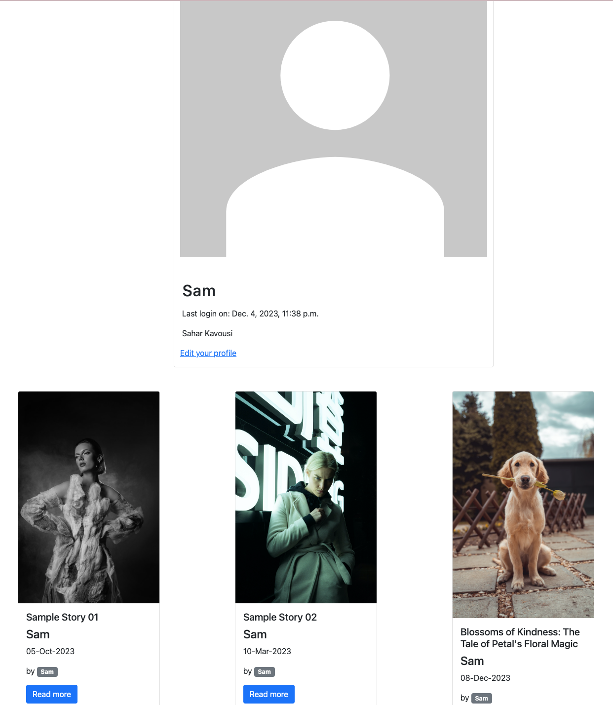
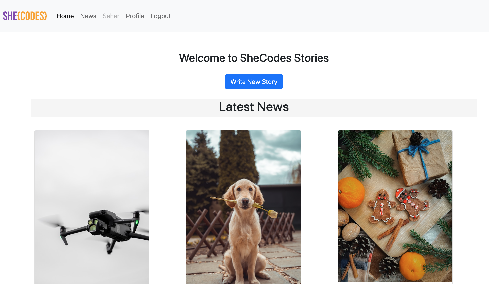
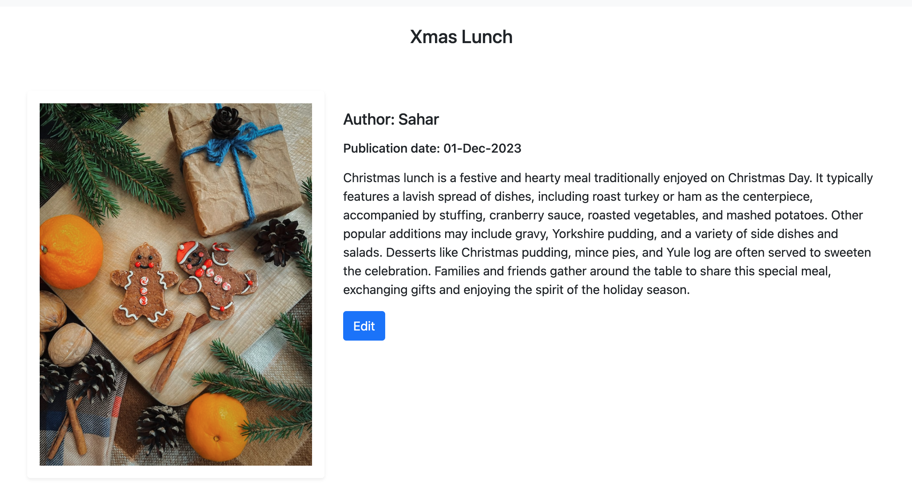

# Plus Resources: Django Project Starter

Starter code for the Plus Django project.

# Sahar Kavousi - She Codes News Project

## About This Project
We used Django to create a website for She Codes New. I create this news website that allows users to read news stories, and authors to create them. 

## How To Run This Code

1- Open a Terminal or Command Prompt.

2-Navigate to the Directory Where You Want to Clone the Repository:
Use the cd command to navigate to the directory where you want to store the Django app.
`cd path/to/your/directory`

3-Clone the Repository:
Use the git clone command to clone the repository. Replace the URL with the URL of the Django app you want to clone. For example:`git clone https://github.com/username/repo.git`

4-Navigate to the Cloned Directory:
Use the cd command to enter the cloned directory:`cd repo`

5-Install Dependencies:
Django apps often have dependencies listed in a requirements.txt file. Use a virtual environment and the following command to install these dependencies:
`python -m venv venv` 
`source venv/bin/activate` # On Windows, use 'venv\Scripts\activate'
`pip install -r requirements.txt`

6-Apply Migrations:
Django apps often require database migrations. Run the following commands:
`python manage.py makemigrations`
`python manage.py migrate`

7-Create a Superuser:
If the app includes user authentication, you might want to create a superuser account:
`python manage.py createsuperuser`

8-Run the Development Server:
Start the Django development server:
`python manage.py runserver`

9-Access the App:
Open your web browser and go to http://localhost:8000/ or the address indicated in the terminal. If you created a superuser, you can also access the Django admin panel at http://localhost:8000/admin/ and log in with the superuser credentials.

## Database Schema

## Project Features
- [x] Order stories by date
    
     

 - [x] Styled "new story" form
    

- [x] Story images
    

- [x] **Log-in/Log-out**

    - **Login:**
      Login serves as the gateway for users to access their accounts. It typically requires users to input their credentials, such as a username or email and a password, to authenticate their identity. After a successful login, users can have access to the "create new story" button and add a new story.
      
      

      

    - **Logout:**
      On the News page, Profile page, and Home page, users have the option to log out, which disconnects them from their current session. Even after logging out, users can still view the stories available on the page. However, to contribute by creating a new story, users are prompted to create an account and log in.
      
        

- [x] "Account view" page
    

- [x] "Create Account" page
    

- [x] View stories by author
    

- [x] "Log-in" button only visible when no user is logged in/"Log-out" buttononly visible when a user *is* logged in
    

- [x] "Create Story" functionality only available when user is logged in
    

## Additional Features:

- [] Add categories to the stories and allow the user to search for stories bycategory.
    

- [x] Add the ability to update and delete stories (consider permissions - whoshould be allowed to update or and/or delete stories).
    

- [ ] Add the ability to “favourite” stories and see a page with your favouritestories.
    

- [ ] Our form for creating stories requires you to add the publication date,update this to automatically save the publication date as the day thestory was first published (maybe you could then add a field to showwhen the story was updated).
    

- [ ] Gracefully handle the error where someone tries to create a new story whenthey are not logged in.
    

[x] "Add comment" form
    
( ./img/readme/comment-sample.png)